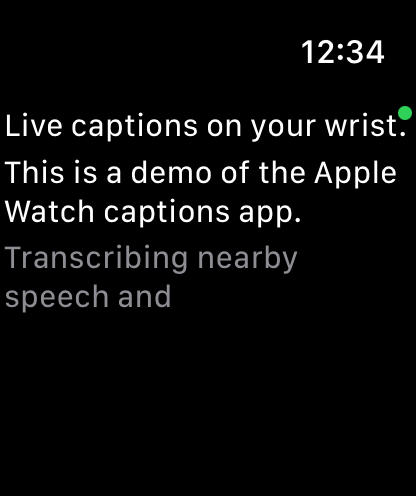

# Apple Watch Captions

A standalone **watchOS** app that listens through the Watch microphone and shows
**live captions** of nearby speech on your wrist — no phone app required. Audio is
streamed to a small relay that runs it through [Deepgram](https://deepgram.com)
speech-to-text and streams caption text back.

Runs whenever the app is open (no buttons); works over the paired iPhone, Wi‑Fi,
or the Watch's own **cellular** when the phone is away.



*Live on the watch: finalized lines in white, the in-progress caption in gray.*

## How it works

```
 Apple Watch                         Fly.io relay                Deepgram
┌───────────────┐   HTTPS (PCM)    ┌──────────────┐   stream    ┌──────────┐
│ mic → 16 kHz  │ ───────────────► │ POST /v1/audio│ ─────────► │  STT     │
│ Int16 PCM     │                  │  per-session  │            │          │
│ caption view  │ ◄─────────────── │  caption buf  │ ◄───────── │ captions │
└───────────────┘   JSON events    └──────────────┘            └──────────┘
```

### Why HTTP and not WebSockets

The obvious design is a WebSocket. But watchOS classifies `URLSessionWebSocketTask`
as *low-level networking*, which it **blocks for normal apps**
([Apple TN3135](https://developer.apple.com/documentation/technotes/tn3135-low-level-networking-on-watchos)) —
`NWPathMonitor` just reports `.unsatisfied`. The only WebSocket-compatible escape
hatch is holding an active CallKit call, but watchOS then keeps the system call UI
in front, hiding the captions.

**High-level HTTP `URLSession` is always allowed**, so the transport is plain HTTP:
the watch batches ~1 second of audio per `POST`, and new caption events come back in
each response. See
[`docs/superpowers/specs/2026-06-14-watch-http-transport-design.md`](docs/superpowers/specs/2026-06-14-watch-http-transport-design.md)
for the full design.

## Repository layout

| Path | What |
|------|------|
| [`watch/`](watch/README.md) | The watchOS app (SwiftUI) + `CaptionCore` Swift package (pure logic, unit-tested). Built with XcodeGen. |
| [`mac/`](mac/README.md) | The macOS menu-bar app (SwiftUI) for live captions on desktop. Shares `CaptionCore` with the watch app; listens to mic and system audio. |
| [`backend/`](backend/README.md) | The STT relay (Node/TypeScript), deployed on Fly.io. |
| [`docs/`](docs/) | Design specs. |

## Transcripts and cross-device sync

Sessions end when you tap Stop (watch) or click the menu-bar button again (mac). Captions and a summary are saved to the transcript store on the relay. You can view transcripts at [`https://watch-captions-relay.fly.dev/app`](https://watch-captions-relay.fly.dev/app) or the Transcripts window in the mac app — the same transcript list syncs across all your devices via the relay.

Transcripts can also sync to **Notion**: set `NOTION_API_KEY` and `NOTION_DATABASE_ID` on the relay and each finished session becomes a page (summary + timestamped transcript) in your Notion database. See [`backend/README.md`](backend/README.md#notion-sync-optional) for setup and the backfill command.

## Transport API

Token auth via `?token=<AUTH_TOKEN>` on every request.

| Endpoint | Request | Response |
|----------|---------|----------|
| `POST /v1/audio?session=<id>&since=<seq>` | raw 16 kHz mono Int16 PCM (may be empty) | `{ "events": [{seq,type,...}], "seq": <latest> }` |
| `POST /v1/stop?session=<id>` | empty | `{ "events": [...], "seq": <latest> }` |
| `GET /healthz` | — | `200 ok` |
| `WS /stream?token=…` | binary PCM frames | JSON caption messages — the mac app's production transport (WebSockets aren't restricted there the way they are on watchOS); accepts `?channels=2` for multichannel (mic + system audio), tagging captions with a `channel`. The watch still uses HTTP polling (see above). |

Event payloads: `{type:"ready"}`, `{type:"caption",text,isFinal}`, `{type:"error",message}`.

## Quick start

**Backend** (see [`backend/README.md`](backend/README.md)):

```bash
cd backend
npm install
AUTH_TOKEN=dev-secret DEEPGRAM_API_KEY=<your-key> PORT=8080 npm run dev
npm test            # 40 tests, no API key needed
```

**Watch app** (see [`watch/README.md`](watch/README.md)):

```bash
cd watch
cp WatchCaptions/Secrets.example.swift WatchCaptions/Secrets.swift   # then edit relay URL + token
xcodegen generate && open WatchCaptions.xcodeproj
```
Select your paired Apple Watch, set your signing team, and run. Allow the mic prompt
on first launch, then speak — captions appear live.

## Deploy

The relay runs on Fly.io:

```bash
cd backend
fly deploy
fly secrets set AUTH_TOKEN=<token> DEEPGRAM_API_KEY=<key>
```

## Tech

watchOS / SwiftUI / AVAudioEngine · Swift Package (`CaptionCore`) · XcodeGen ·
Node + TypeScript · Deepgram streaming STT · Fly.io · Vitest.
