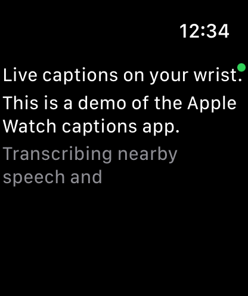
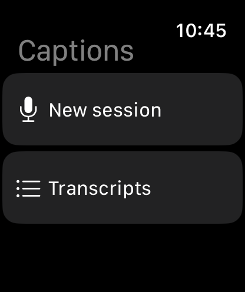
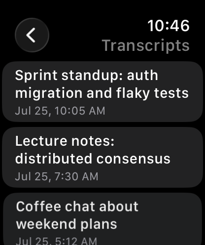
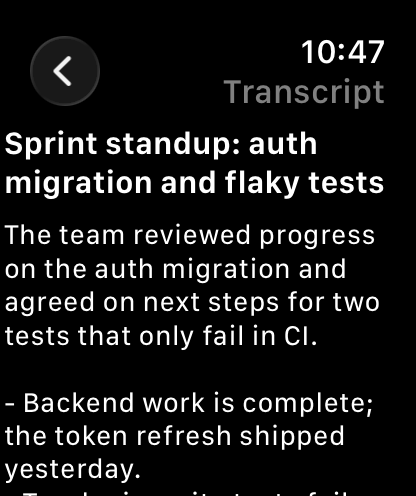

# Apple Watch Captions

A standalone **watchOS** app that listens through the Watch microphone and shows
**live captions** of nearby speech on your wrist — no phone app required. Audio is
streamed to a small relay that runs it through [Deepgram](https://deepgram.com)
speech-to-text and streams caption text back.

Runs whenever the app is open (no buttons); works over the paired iPhone, Wi‑Fi,
or the Watch's own **cellular** when the phone is away.



*Live on the watch: finalized lines in white, the in-progress caption in gray.*

<table>
<tr>
<td></td>
<td></td>
<td></td>
</tr>
<tr>
<td align="center"><em>Menu</em></td>
<td align="center"><em>Transcripts</em></td>
<td align="center"><em>Summary</em></td>
</tr>
</table>

*Transcripts and summaries shown above use sample data.*

## How it works

```
 Apple Watch                         Fly.io relay                Deepgram
┌───────────────┐   HTTPS (PCM)    ┌──────────────┐   stream    ┌──────────┐
│ mic → 16 kHz  │ ───────────────► │ POST /v1/audio│ ─────────► │  STT     │
│ Int16 PCM     │                  │  per-session  │            │          │
│ caption view  │ ◄─────────────── │  caption buf  │ ◄───────── │ captions │
└───────────────┘   JSON events    └──────────────┘            └──────────┘
```

### Why HTTP and not WebSockets

The obvious design is a WebSocket. But watchOS classifies `URLSessionWebSocketTask`
as *low-level networking*, which it **blocks for normal apps**
([Apple TN3135](https://developer.apple.com/documentation/technotes/tn3135-low-level-networking-on-watchos)) —
`NWPathMonitor` just reports `.unsatisfied`. The only WebSocket-compatible escape
hatch is holding an active CallKit call, but watchOS then keeps the system call UI
in front, hiding the captions.

**High-level HTTP `URLSession` is always allowed**, so the transport is plain HTTP:
the watch batches ~1 second of audio per `POST`, and new caption events come back in
each response. See
[`docs/superpowers/specs/2026-06-14-watch-http-transport-design.md`](docs/superpowers/specs/2026-06-14-watch-http-transport-design.md)
for the full design.

## Repository layout

| Path | What |
|------|------|
| [`watch/`](watch/README.md) | The watchOS app (SwiftUI), depending on the `CaptionCore` Swift package (pure logic, unit-tested) from [`jonyen/caption-core`](https://github.com/jonyen/caption-core). Built with XcodeGen. |
| [`ios/`](ios/README.md) | The iPhone app (SwiftUI) and its ReplayKit broadcast extension: captions whatever the phone plays, read on the Watch. Also where the Watch app's settings are edited. |
| [`CaptionRelay/`](CaptionRelay) | Swift package with the relay-specific transport code shared between the watch and iOS apps. |
| [`backend/`](backend/README.md) | The STT relay (Node/TypeScript), deployed on Fly.io. |
| [`docs/`](docs/) | Design specs. |

## Related repos

- [`jonyen/caption-core`](https://github.com/jonyen/caption-core) — the shared caption engine core (`CaptionEngine`, `CaptionEvent`, `CaptionStore`, `SessionController`), extracted so both this repo and the Mac app can depend on it.
- [`jonyen/mac-live-captions`](https://github.com/jonyen/mac-live-captions) — the macOS menu-bar overlay app for live captions on desktop, hotkey-summoned and fully on-device.

## Transcripts and cross-device sync

Sessions end when you tap Stop on the watch. Captions and a summary are saved to the transcript store on the relay, so the watch and iPhone stay in sync. You can view transcripts at [`https://watch-captions-relay.fly.dev/app`](https://watch-captions-relay.fly.dev/app). The Mac app now lives in its own repo, [`jonyen/mac-live-captions`](https://github.com/jonyen/mac-live-captions) (see Related repos above) — it captions on-device and doesn't use this relay's transcript store.

Set `NOTION_TOKEN` and `NOTION_DATABASE_ID` on the relay and each finished session also lands in a Notion database — a collapsed Summary toggle and a collapsed Full transcript toggle. Exports are recorded per transcript, so they never duplicate, and anything that failed (or predates the integration) is retried on the next relay boot. Setup and the pre-flight check are in [`backend/README.md`](backend/README.md#notion-export-optional).

The watch notifies you when the page is ready. The export finishes well after the conversation does — the relay summarizes first, then writes the page — so the wait is persisted and picked up by a background refresh or the next launch, rather than dying with the screen.

## Transport API

Each app self-registers a device with `POST /v1/devices` on first launch and
gets its own bearer token back; every other request carries it, either as
`Authorization: Bearer <token>` or `?token=<token>`. See
[`backend/README.md`](backend/README.md#authentication) for the full model
(pairing, the admin token, etc.).

| Endpoint | Request | Response |
|----------|---------|----------|
| `POST /v1/audio?session=<id>&since=<seq>` | raw 16 kHz mono Int16 PCM (may be empty) | `{ "events": [{seq,type,...}], "seq": <latest> }` |
| `GET /v1/presence?session=<id>` | — | `{ "reader": true, "producer": true }` — who polled with `role=reader`, and who fed audio, in the last 10s. The phone asks before streaming, so audio nobody is watching never leaves the device; the watch asks to open straight into captions when the phone is broadcasting. |
| `POST /v1/stop?session=<id>` | empty | `{ "events": [...], "seq": <latest> }` |
| `GET /healthz` | — | `200 ok` |
| `WS /stream?token=…` | binary PCM frames | JSON caption messages — retained for testing from a real computer (see `backend/src/server.ts`); no production client uses it, since watchOS blocks WebSockets (TN3135) and the Mac app now captions on-device in its own repo. Accepts `?channels=2` for multichannel (mic + system audio), tagging captions with a `channel`. The watch uses HTTP polling (see above). |

Event payloads: `{type:"ready"}`, `{type:"caption",text,isFinal}`, `{type:"error",message}`.

## Quick start

**Backend** (see [`backend/README.md`](backend/README.md)):

```bash
cd backend
npm install
DEEPGRAM_API_KEY=<your-key> PORT=8080 npm run dev
npm test            # no API key needed
```

**Watch app** (see [`watch/README.md`](watch/README.md)):

```bash
cd watch
cp WatchCaptions/Secrets.example.swift WatchCaptions/Secrets.swift   # then edit relay URL + token
xcodegen generate && open WatchCaptions.xcodeproj
```
Select your paired Apple Watch, set your signing team, and run. Allow the mic prompt
on first launch, then speak — captions appear live.

## Deploy

The relay runs on Fly.io:

```bash
cd backend
fly deploy
fly secrets set DEEPGRAM_API_KEY=<key>
# Optional: ADMIN_TOKEN gates GET /v1/usage (the operator cost/usage endpoint).
fly secrets set ADMIN_TOKEN=$(openssl rand -hex 32)
```

See [`backend/DEPLOY.md`](backend/DEPLOY.md) for the full deploy walkthrough.

## Tech

watchOS / SwiftUI / AVAudioEngine · Swift Package (`CaptionCore`) · XcodeGen ·
Node + TypeScript · Deepgram streaming STT · Fly.io · Vitest.
